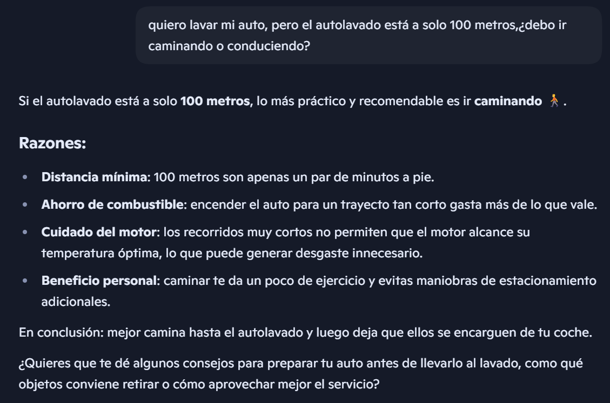
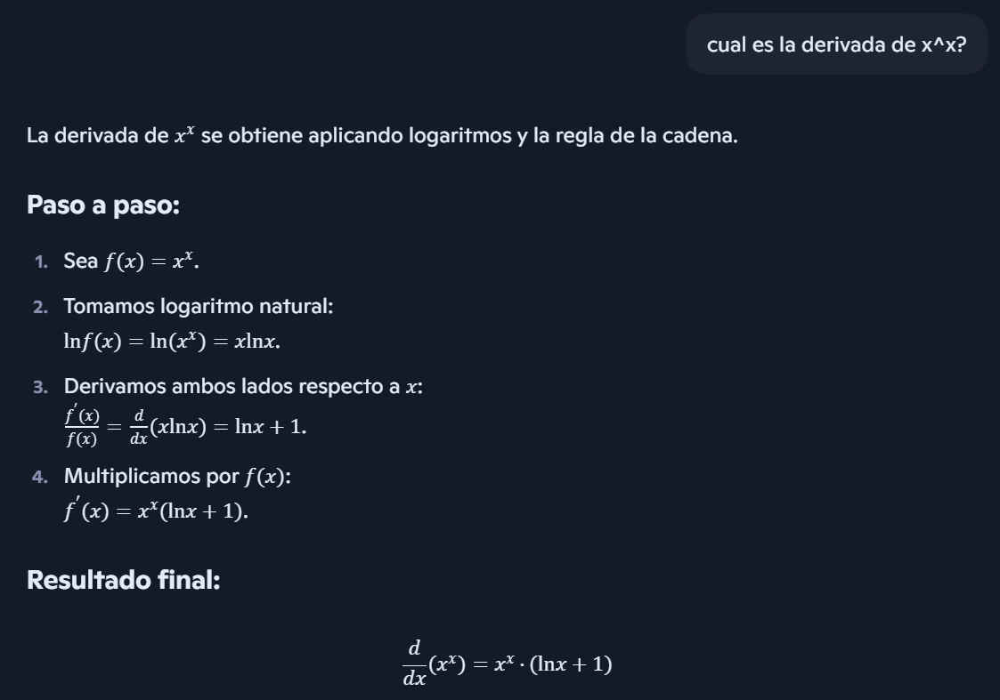

# [Actividad extracurricular 10] Confabulación en los modelos de lenguaje
Nombre: Erick Cuichan

Curso: GR1CC

---

Modelo de IA utilizado: Copilot

### Pregunta 1 
Prompt: Quiero lavar mi auto, pero el autolavado está a solo 100 metros, ¿debo ir caminando o conduciendo?

Explicación: El modelo presentó un error ya que: en la respuesta solo importa la practicidad, pero no considera el contexto real: para lavar el auto normalmente necesitas llevar el auto al autolavado.

Ir caminando dejaría el auto atrás, así que la respuesta no tiene sentido lógico en esa situación.

---

### Pregunta 2 
Prompt: ¿Cuál es la derivada de x^x?

Explicación: Los modelos de AI tiene  gran cantidad de entrenamiento de datos, así que es muy poco probable que estos caigan en alucinación, pero aún siguen teniendo errores en cuanto a calculos matemáticos 

---

### Pregunta 3

Prompt: Dime la lista completa de libros que escribiò Gabriel Garcia Marquez en 1978

Explicación: El modelo tuvo una confusión al tomar los lanzamientos periodosticos como si fuera un libro publicado, lo cual nos hace enteneder que sufre una confusón entre tipos de obras y una interpretacion incorrecta del contexto histórico 